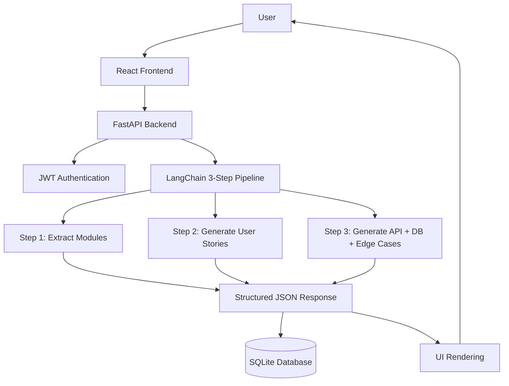

# Requirements → User Stories & API Copilot

A production-ready, end-to-end GenAI application that converts messy raw requirement text into structured specifications including modules, user stories, API endpoints, database schemas, and edge cases.

## 🎯 Project Overview

This application uses LangChain with a 3-step sequential pipeline to transform unstructured requirement text into comprehensive technical specifications. It's designed for both Product Managers (PM View) and Developers (Developer View), with features like specification refinement, history tracking, and JSON export.

## 🏗️ Architecture



## 📁 Project Structure

```
requirements-spec-copilot/
├── backend/
│   ├── __init__.py
│   ├── main.py                 # FastAPI application entry point
│   ├── core/
│   │   ├── __init__.py
│   │   └── auth.py             # JWT authentication utilities
│   ├── database/
│   │   ├── __init__.py
│   │   └── db.py               # SQLite database setup
│   ├── langchain_pipeline/
│   │   ├── __init__.py
│   │   └── pipeline.py         # 3-step LangChain pipeline
│   ├── models/
│   │   ├── __init__.py
│   │   ├── user.py             # User Pydantic models
│   │   └── spec.py             # Specification Pydantic models
│   └── routes/
│       ├── __init__.py
│       ├── auth.py             # Authentication routes
│       └── generate.py         # Specification generation routes
├── frontend/
│   ├── public/
│   │   └── index.html
│   ├── src/
│   │   ├── components/         # React components
│   │   │   ├── Navbar.jsx
│   │   │   ├── RequirementInput.jsx
│   │   │   ├── SpecOutput.jsx
│   │   │   └── HistoryPanel.jsx
│   │   ├── contexts/
│   │   │   └── DarkModeContext.jsx
│   │   ├── hooks/
│   │   │   └── useAuth.jsx
│   │   ├── pages/
│   │   │   ├── Signup.jsx
│   │   │   ├── Login.jsx
│   │   │   └── Dashboard.jsx
│   │   ├── services/
│   │   │   └── api.js
│   │   ├── App.jsx
│   │   ├── index.js
│   │   └── index.css
│   ├── webpack.config.js
│   ├── .babelrc
│   ├── tailwind.config.js
│   ├── postcss.config.js
│   └── package.json
├── requirements.txt
└── README.md
```

## 🔄 How LangChain Pipeline Works

The application uses a **3-step sequential pipeline** to generate specifications:

### Step 1: Extract Modules/Features
- **Prompt**: "Extract the high-level modules/features from the requirement."
- **Output**: JSON array of modules with names and descriptions
- **Purpose**: Identify the main functional areas of the application

### Step 2: Generate User Stories
- **Prompt**: "Generate detailed user stories for each module using standard user story format."
- **Output**: JSON array of user stories with:
  - Module association
  - Story in format: "As a [role], I want [feature] so that [benefit]"
  - Acceptance criteria
- **Purpose**: Create user-centric requirements documentation

### Step 3: Generate API + DB + Edge Cases
- **Prompt**: "Generate production-level API endpoints, DB schema, and edge cases for each module. Include request/response examples."
- **Output**: JSON object containing:
  - **API Endpoints**: URL, method, description, request/response schemas
  - **Database Schema**: Table names, columns, data types, constraints
  - **Edge Cases**: Scenarios and handling strategies
- **Purpose**: Provide technical implementation details

### Output Format

```json
{
  "modules": [
    {
      "name": "Module Name",
      "description": "Module description"
    }
  ],
  "user_stories": [
    {
      "module": "Module Name",
      "story": "As a user, I want...",
      "acceptance_criteria": ["Criteria 1", "Criteria 2"]
    }
  ],
  "api_endpoints": [
    {
      "endpoint": "/api/endpoint",
      "method": "POST",
      "description": "Endpoint description",
      "request_schema": {...},
      "response_schema": {...},
      "module": "Module Name"
    }
  ],
  "db_schema": [
    {
      "table_name": "table_name",
      "columns": [
        {
          "column_name": "id",
          "data_type": "INTEGER",
          "constraints": "PRIMARY KEY",
          "description": "Column description"
        }
      ],
      "module": "Module Name"
    }
  ],
  "edge_cases": [
    {
      "module": "Module Name",
      "scenario": "Edge case description",
      "handling": "How to handle it"
    }
  ]
}
```

## 🚀 Deployment Steps

### Prerequisites
- Python 3.8+
- Node.js 16+
- OpenAI API key (or configure alternative LLM provider)

### Backend Setup

1. **Navigate to project root**:
   ```bash
   cd requirements-spec-copilot
   ```

2. **Create virtual environment**:
   ```bash
   python -m venv venv
   source venv/bin/activate  # On Windows: venv\Scripts\activate
   ```

3. **Install dependencies**:
   ```bash
   pip install -r requirements.txt
   ```

4. **Set environment variables**:
   ```bash
   export OPENAI_API_KEY="your-api-key-here"
   export SECRET_KEY="your-secret-key-here"  # For JWT
   ```

5. **Run the backend**:
   ```bash
   uvicorn backend.main:app --reload --port 8000
   ```

The API will be available at `http://localhost:8000`

### Frontend Setup

1. **Navigate to frontend directory**:
   ```bash
   cd frontend
   ```

2. **Install dependencies**:
   ```bash
   npm install
   ```

3. **Set environment variables** (optional):
   Create a `.env` file:
   ```
   REACT_APP_API_URL=http://localhost:8000
   ```

4. **Run development server**:
   ```bash
   npm run dev
   ```

The frontend will be available at `http://localhost:3000`

### Production Build

**Backend**:
```bash
# The backend can be deployed using uvicorn with production settings
uvicorn backend.main:app --host 0.0.0.0 --port 8000
```

**Frontend**:
```bash
cd frontend
npm run build
# The dist/ folder contains the production build
```

### HuggingFace Spaces Deployment

1. **Update requirements.txt** for HuggingFace compatibility
2. **Configure environment variables** in Spaces settings
3. **Update LangChain pipeline** to use HuggingFace models if needed
4. **Deploy backend** as a Space
5. **Deploy frontend** separately or as a static site

## 📝 Sample Input/Output

### Input Example
```
Build an e-commerce platform with user authentication, product catalog, 
shopping cart, and checkout functionality. Users should be able to search 
products, add items to cart, and complete purchases with payment integration.
```

### Output Structure
- **Modules**: User Management, Product Catalog, Shopping Cart, Checkout, Payment
- **User Stories**: Multiple stories per module with acceptance criteria
- **API Endpoints**: RESTful endpoints for each feature
- **Database Schema**: Tables for users, products, orders, etc.
- **Edge Cases**: Handling duplicate orders, payment failures, inventory issues

## ✨ Features

### Core Features
- ✅ **3-Step LangChain Pipeline**: Sequential processing for structured output
- ✅ **JWT Authentication**: Secure user authentication and authorization
- ✅ **PM View**: Non-technical summary for product managers
- ✅ **Developer View**: Full technical specification with all details
- ✅ **Specification Refinement**: Refine existing specs with additional instructions
- ✅ **History Tracking**: Save and load previous specifications
- ✅ **JSON Export**: Download specifications as JSON files

### UI Features
- ✅ **Dark Mode**: Toggle between light and dark themes
- ✅ **Responsive Design**: Works on desktop, tablet, and mobile
- ✅ **Loading Indicators**: Visual feedback during API calls
- ✅ **Error Handling**: Toast notifications for errors
- ✅ **Collapsible Sections**: Organize output for better readability

### Technical Features
- ✅ **SQLite Database**: Persistent storage for users and history
- ✅ **CORS Configuration**: Proper cross-origin resource sharing
- ✅ **Pydantic Validation**: Request/response validation
- ✅ **Webpack Build**: Production-ready frontend bundling

## 🔧 Configuration

### Backend Configuration
- **Database**: SQLite (can be changed to PostgreSQL/MySQL)
- **Authentication**: JWT with configurable expiration
- **LLM Provider**: OpenAI (configurable to other providers)

### Frontend Configuration
- **Build Tool**: Webpack
- **Styling**: Tailwind CSS
- **State Management**: React Context API
- **Routing**: React Router

## 🛠️ Improvements & Future Enhancements

### Potential Improvements
1. **Multi-LLM Support**: Add support for HuggingFace, Anthropic, etc.
2. **Template System**: Pre-defined templates for common application types
3. **Collaboration**: Share specifications with team members
4. **Version Control**: Track changes to specifications over time
5. **Export Formats**: Support for Markdown, PDF, OpenAPI/Swagger
6. **Integration**: Connect with Jira, Confluence, GitHub Issues
7. **AI Suggestions**: Proactive suggestions for missing requirements
8. **Validation**: Check for common issues in generated specs
9. **Testing**: Add unit and integration tests
10. **Performance**: Optimize LangChain pipeline for faster responses

### Security Enhancements
- Rate limiting for API endpoints
- Input sanitization and validation
- SQL injection prevention (already using parameterized queries)
- XSS protection in frontend
- HTTPS enforcement in production

## 📚 API Documentation

Once the backend is running, visit:
- **Swagger UI**: `http://localhost:8000/docs`
- **ReDoc**: `http://localhost:8000/redoc`

### Key Endpoints

- `POST /auth/signup` - Register new user
- `POST /auth/login` - Authenticate user
- `POST /generate/spec` - Generate specification (protected)
- `POST /generate/refine/spec` - Refine specification (protected)
- `GET /generate/history` - Get user's history (protected)

## 🤝 Contributing

1. Fork the repository
2. Create a feature branch
3. Make your changes
4. Submit a pull request

## 📄 License

This project is open source and available under the MIT License.

## 🙏 Acknowledgments

- Built with FastAPI, React, and LangChain
- Uses OpenAI for LLM capabilities
- Styled with Tailwind CSS

